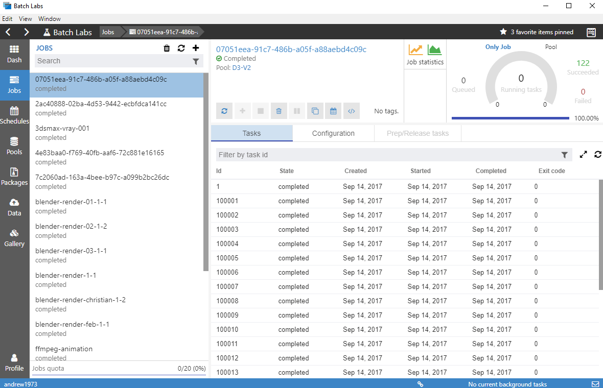
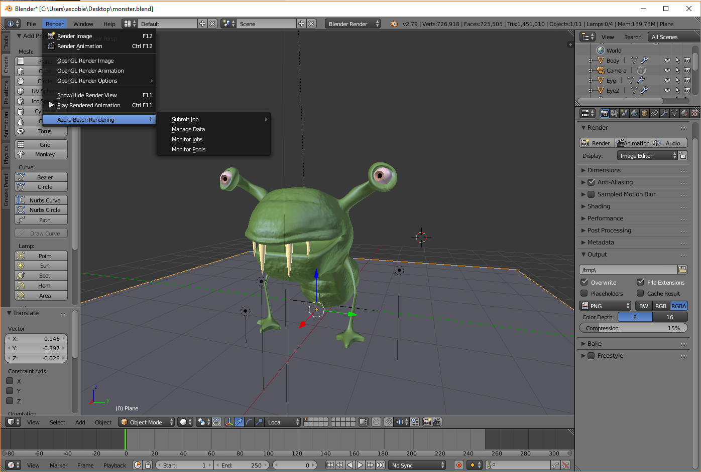
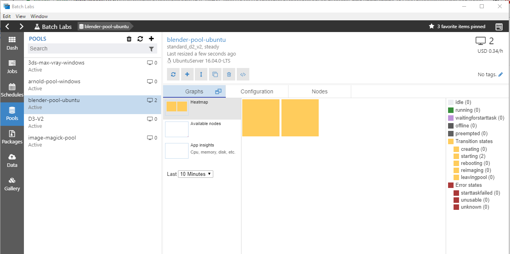

# Azure Batch Rendering
BatchLabs plugin for Blender. This plugin allows you to use BatchLabs and the Azure Batch Rendering Service to render your scenes in the cloud.

## BatchLabs
Batch Labs is a tool to manage your Azure Batch accounts. The goal is to implement a great user experience that will help you debug, monitor and manage your pools, jobs and tasks. It also includes experimental features such as `Batch Templates` in the aim to improve your Batch experience. BatchLabs is updated monthly with new features and bug fixes. You can download it for Windows, macOS, and Linux on [BatchLabs website](https://azure.github.io/BatchLabs/).



## Installing the plugin
These steps will outline how to install and use the Blender plugin.
#### 1. Install BatchLabs
Install the latest version of [BatchLabs](https://azure.github.io/BatchLabs/). This is the tool that will do the majority of the work to get your Blender scenes rendering in the cloud.

#### 2.1 Install the Blender plugin
Get the latest zip file from [the repository](https://github.com/Azure/azure-batch-rendering/tree/master/plugins/blender/blender.client/build). 

- Open the Blender application
- Open the user preferences window: ```File -> User Preferences```
- Click ```Install Add-on from File``` button
- Navigate to the plugin zip file you downloaded earlier and select the ```Install Add-on from File``` button.

**Note:** you will need to check the checkbox to enable the plugin.


#### 2.2 Set the User Preferences
The plugin contains a couple of handy user preferences.


**Log directory** - is where any logs from the plugin will be written to. Note that logs will also be written to the Blender system console that you can view by selecting the following menu: ```Window -> Toggle System Console```

**Log level** - You can set it to ignore basic log messages, but the default of Debug will be fine as there are not that many logs being generated.

**Batch Account** - If you have many Batch accounts and would like the plugin to default to using a single account, you can set the fully qualified resource ID of the account. An example of which would be: ```/subscriptions/<sub-id>/resourceGroups/<resource-group>/providers/Microsoft.Batch/batchAccounts/<account-name>```.

This will ensure that every time you open BatchLabs from the Blender plugin, it will use this account. Otherwise it will default to the last account you were using in BatchLabs.

**Pool Type** - When submitting a job, you can use a persistent pre-existing pool, or an auto-pool that is created when the job is submitted and then deleted when the job is completed. While auto-pools can be handy, they can also make it hard to diagnose some issues with the job should you have any. It is recommended that while you are rendering your test scenes that you use a persistent pool. Once you are happy with the process you can switch to using an auto-pool should you wish.

## Using the plugin
The Blender plugin gives you 4 menu options. It can be accessed via: ```Render -> Azure Batch Rendering```. All commands take you to the corresponding page in the BatchLabs application.



**Submit Job** - Allows you to submit a rendering job using our job templating service. It will pre-populate some fields and get you submitting a job in no time with the click of a button. Currently we use Ubuntu 16.04 machines, but we will be adding a Windows Server option shortly. Should you have a requirement for any other machine type then let us know and we can add a template for you. The best place to raise this would be the [BatchLabs issues register on GitHub](https://github.com/Azure/BatchLabs/issues).

**Manage Data** - Will take you to the screen where you can select and upload your data into a file group so that it can be referenced by your job.

**Monitor Jobs** - Takes you to your jobs dashboard.

**Monitor Pools** - Takes you to your pools dashboard.

#### 1. Upload inputs to a File Group
Before you submit your job, you'll need to upload you scenes input data to a file group. We are working on new and improved ways to make it easier to get your data into the cloud. At this stage we will need to manually create a file group.

Click on the ```Manage Data``` menu item, or if you are already in BatchLabs, then click on the ```Data``` menu and then click on the ```+ -> From Local Folder``` option to create a new file group.

Give the file group a name, this could be something like a project name for the scene. For this example, we'll use ```blender-project```.

Select the root folder of your assets. Ensure ```Include sub directories``` is checked. Under File options keep the ```Prefix``` empty, ```Flatten``` and ```Full path``` disabled. If you have multiple asset locations, then get in touch and we can help you sort out the best way to get you working.


Click ```Upload and close```. You'll see the form close and the upload progressing under background tasks in the application footer.

You can view your new file group and the data in it under ```Data -> blender-project```. Below you should see all the files and folders that you just uploaded.


#### 2.1 Submit your job
Now that the scene files have been uploaded you can submit the job. From the ```Render``` menu, select ```Azure Batch Rendering -> Submit Job -> Render movie on Ubuntu 16.4```. This will take you to the correct location in BatchLabs and provided you left the default user preference of ```Use persistent pool```, you will see a UI like this.


**Note** - If you have not created a pool to run your job on, then we can do that now. Rendering jobs need to be run on the correct type of pool. Only a pool that was created with the correct Blender template will work. Click on the ```Create pool for later use``` button and you will see this form:


- Enter a pool name, or leave the default which will be: ```blender-pool-ubuntu```.
- Choose the number of compute nodes, the template defaults to 5, but for the sake of an initial test we can use 1 or 2. For very large jobs we can select virtually any number of compute nodes. Any new Batch Account will have a default Quota of 20 cores. If you are using 2 core machines, then you can create a pool with 10 compute nodes should you wish. Note that you will pay for the time the compute nodes are running. You can send in a support request to have this number increased should you wish.
- Select a compute node size. For this example, we'll use a single ```Standard_D2_v2``` compute node which has 2 cores. You can see more information about the various Azure Compute Node sizes [here](https://docs.microsoft.com/en-us/azure/virtual-machines/windows/sizes).
- Select the ```Max tasks per node```. This is how many simultanious tasks that can be run on a single compute node. For small, less CPU bound jobs, you can normally get away with running 1 task per CPU, but for normal rendering purposes a single task per compute node should would out to be optimal.

Click on the big green button.

Note: Once the pool is created, you don't have to delete it in-between jobs. You can just use BatchLabs to rescale the pool down to 0 nodes and you will no longer pay for any compute node uptime. Next time you want to run a Blender job, just select: ```Pools -> blender-pool-ubuntu``` and click on the scale button to re-scale the pool up again with new compute nodes. If you contact us we can help you with an auto scale formula that will scale up when new jobs attempt to use the pool, and automatically scale down again once the jobs have completed.



After a minute or so you should see the compute nodes appear in the pool heatmap. Then will transition from ```Starting -> Waiting for Start Task -> Idle```. The entire process should be done in about 5 - 10 minutes. This can take longer depending on the number and size of machines you requested. We install Blender on each of the compute nodes as they are created which is what is happening in the `Wait for Start Task` state.

There is no reason why you cannot submit a job now, tasks will start to be run as soon as any of the compute node become ```Idle```.

#### 2.2 Actually Submitting your job
If you created a pool, then we need to click on the ```Azure Batch Rendering -> Submit Job -> Render movie on Ubuntu 16.4``` in Blender again as this action pre-populates some of your initial job data. The act of creating a pool as wiped this data from BatchLabs so we need do it again. As BatchLabs is already open then this action will be very quick.

From the submit job form, select the following:

- Select the pool you created earlier from the Pool list. In our case it was ```blender-pool-ubuntu```
- For the ```Job name``` either keep the default or enter something meaningful. **Note that each job within a given Batch account must have a unique name.**
- For the ```Input data``` select the ```blender-project``` file group that you created earlier. The warning under the ```Blend file``` option should now go away. Should no blend file be selected, then click on the button and browse to the main .blend file for your scene. Note that each file group will now be prefixed with ```fgrp-```.
- ```Frame start``` and ```Frame end``` can either stipulate a frame range, or you can just enter a single frame number in each to only render that frame. Each frame will have its own task created within the job.
- Select the ```Outputs``` file group. This is a file group that any job outputs will be written to including the logs for the job. You can use the same file group you created earlier should you wish. I normally would use a file group called ```outputs``` that I write all job outputs to. I find this easier to manage as each job writes outputs under a folder with the same name as the job. If you are running multiple jobs for a given scene then you could call your output file group: ```outputs-<scene-name>```, that way all the outputs relating to that scene are in the same place.


Once each form field is completed, the submit button will be enabled and you can click on the green button to submit the job. Once successfully submitted, you will be taken to the job details page where you can view the progress of the job.


The running task graph in the top right will show you how many tasks are currently running. You might have to click on the refresh button at the top right of the task list in order for the task table to update.


Once completed you can click on any task to look at the details and outputs of that task. Note that as soon as the pool has been scaled down any files on the compute node are no longer available, but any logs and outputs will have also been uploaded to the output file group you specified when you submitted the job.


And that's it. If you have any queries or questions. Please get in touch at ```Azure Batch Rendering <rendering at microsoft.com>```, and we will be happy to help you out
